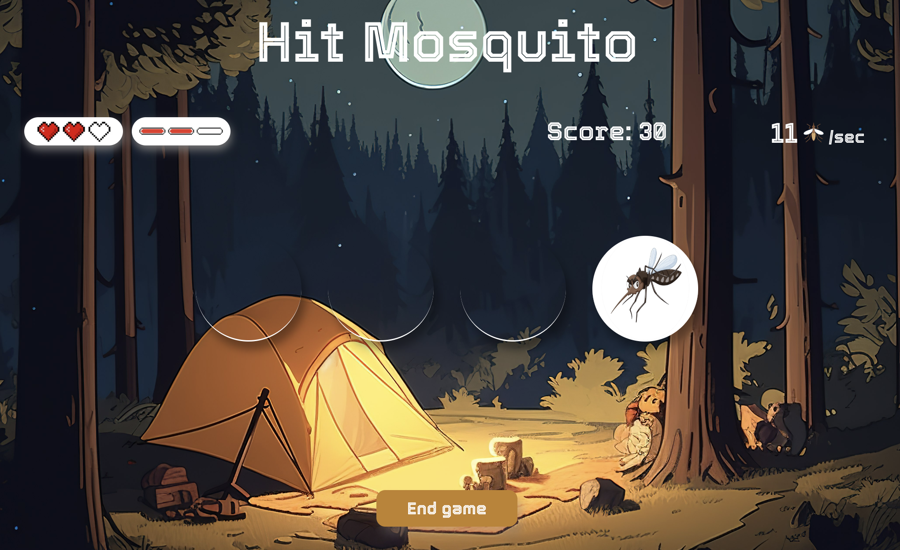

# Speed game

## General Information

My version of a Speed game project for JavaScript course at Business College Helsinki in August - October 2023.
It's called Hit mosquito, a player has to be fast and hit the circle where a mosquito appears, progressively speed increases. The interface imitates a computer game. There are 3 health points per life and a total of 3 lives.

## Technologies Used

JavaScript, HTML, CSS

## Features

- Health points, life bar
- Sound

## Screenshots

